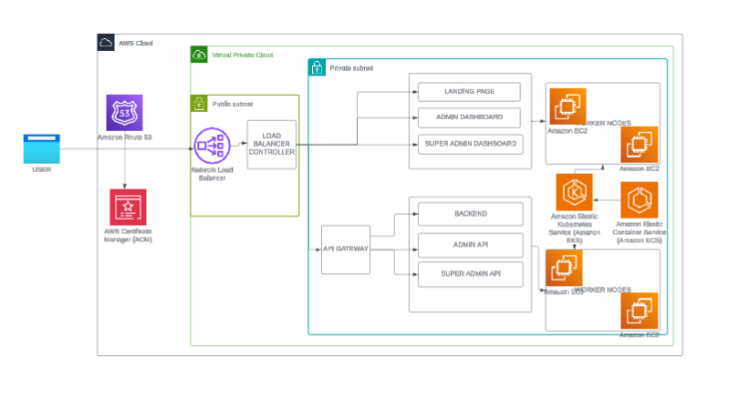
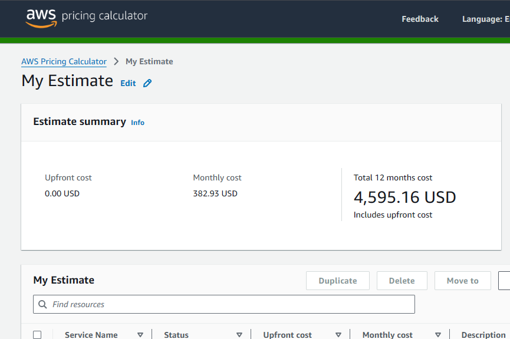

# AWS Application Architecture Documentation

## 1. Overview

This documentation outlines the architecture for hosting seven core Gkpele applications on AWS. The design is built on Amazon EKS for container orchestration, ensuring scalability and security within a Virtual Private Cloud (VPC).

The applications are:
- **Landing Page**
- **Admin Dashboard**
- **Super Admin Dashboard**
- **Backend**
- **Admin API**
- **Super Admin API**
- **API Gateway** (implied routing layer)

## 2. Architecture Diagram

## 3. Core AWS Services & Components

### 3.1. DNS and Certificate Management
- **Amazon Route 53**: Manages DNS and routes user traffic to the correct endpoint.
- **AWS Certificate Manager (ACM)**: Provides and manages SSL/TLS certificates for secure HTTPS connections.

### 3.2. Networking
- **Amazon VPC (Virtual Private Cloud)**: The isolated network foundation for all resources.
- **Public Subnet**: Hosts resources that need direct internet access.
- **Private Subnet**: Hosts application resources, protecting them from direct public exposure.

### 3.3. Traffic Management
- **Network Load Balancer (NLB)**: The single entry point that distributes incoming traffic to the correct services based on URL paths.
- **AWS Load Balancer Controller**: A Kubernetes controller that automatically configures the NLB based on Ingress rules.

### 3.4. Compute & Orchestration
- **Amazon EKS (Elastic Kubernetes Service)**: The managed Kubernetes control plane.
- **EKS Node Group**: A group of Amazon EC2 instances that run the application pods.
- **Amazon EC2**: The compute capacity for the worker nodes.

### 3.5. Container Registry
- **Amazon ECR (Elastic Container Registry)**: Stores and manages the Docker images for all applications.

### 3.6. Security
- **Security Groups**: Act as virtual firewalls for EC2 instances and the ALB.
- **NAT Gateway**: Allows resources in private subnets to access the internet for updates while blocking unsolicited inbound traffic.

## 4. Data Flow

1.  User requests the application URL.
2.  **Route 53** resolves the domain to the **ALB**'s IP address.
3.  A secure connection is established using the **ACM** certificate.
4.  The **ALB** routes the request based on its path (e.g., `/api` to backend, `/admin` to dashboard).
5.  The **Load Balancer Controller** ensures the request reaches the correct **Kubernetes Pod** in the private subnet.
6.  The target application processes the request and sends a response back.

## 5. Cost Management & Monitoring

- **AWS Budgets**: Set to alert via email/SNS when spending exceeds configured thresholds (e.g., 80% of the monthly budget). Primary tool for cost control.

## 6. Key Characteristics

- **Scalability**: EKS and ALB can scale automatically with traffic.
- **High Availability**: Resources are distributed across multiple Availability Zones.
- **Security**: Layered security with private subnets, security groups, and encrypted traffic.
- **Managed Services**: Reduces operational overhead by leveraging AWS-managed services.

## 7. Budget

- **
